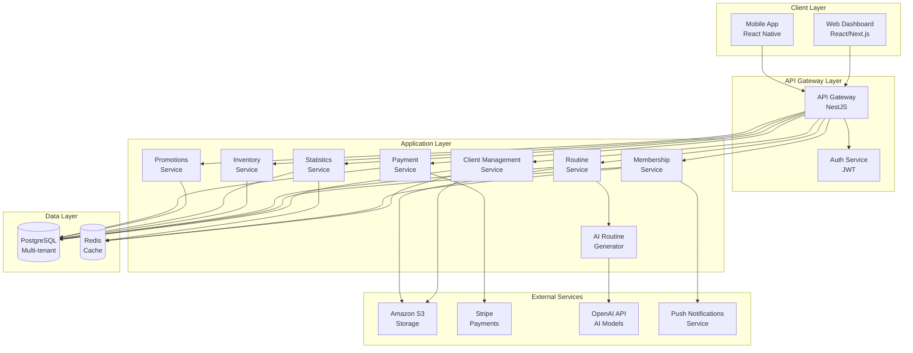
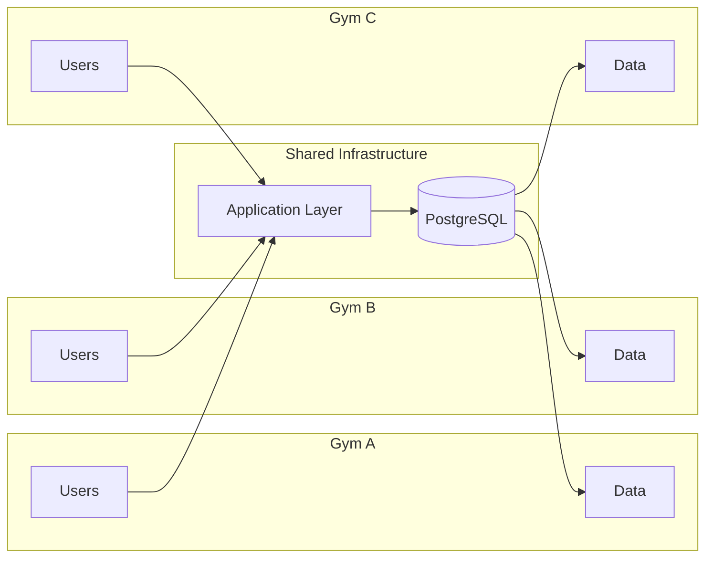
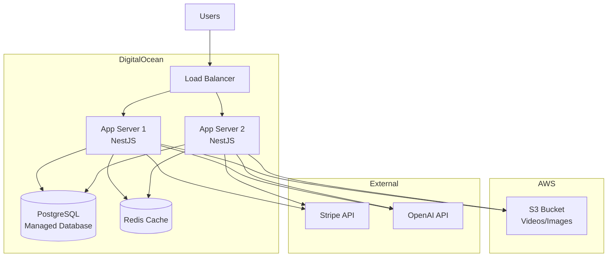
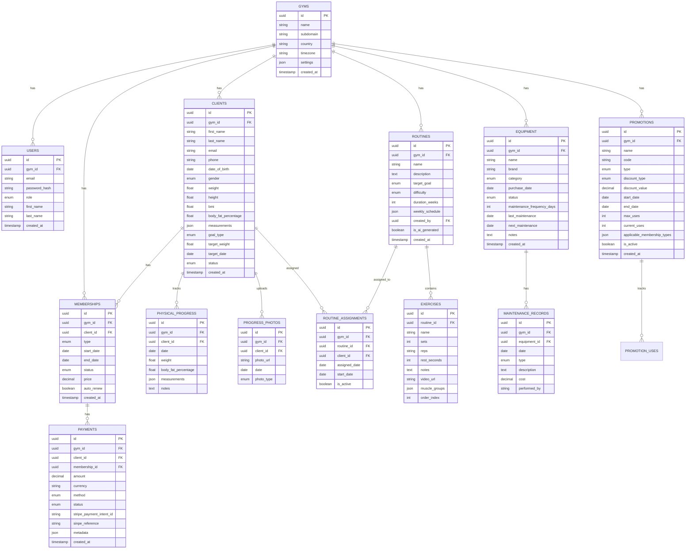
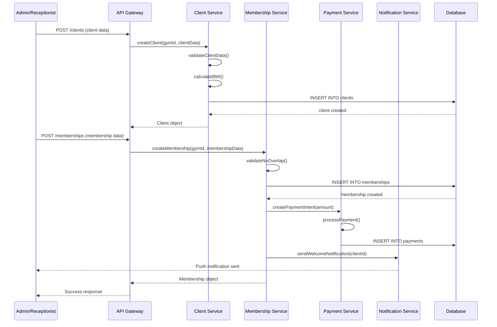
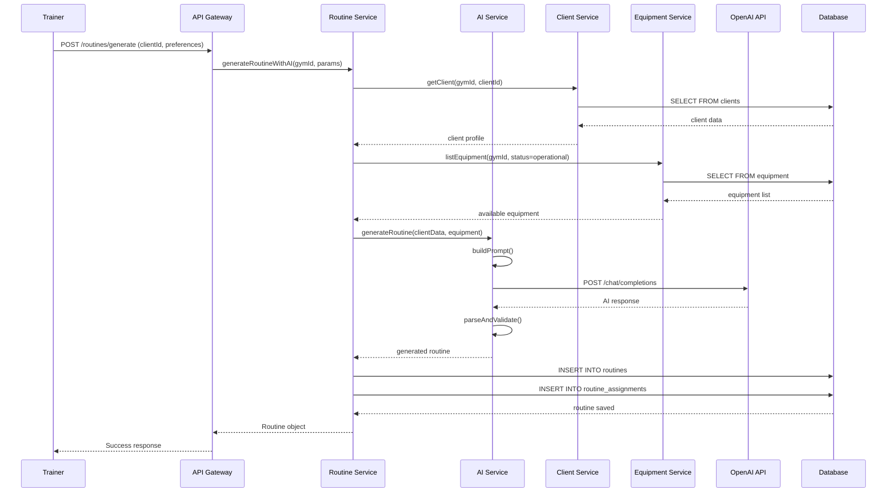
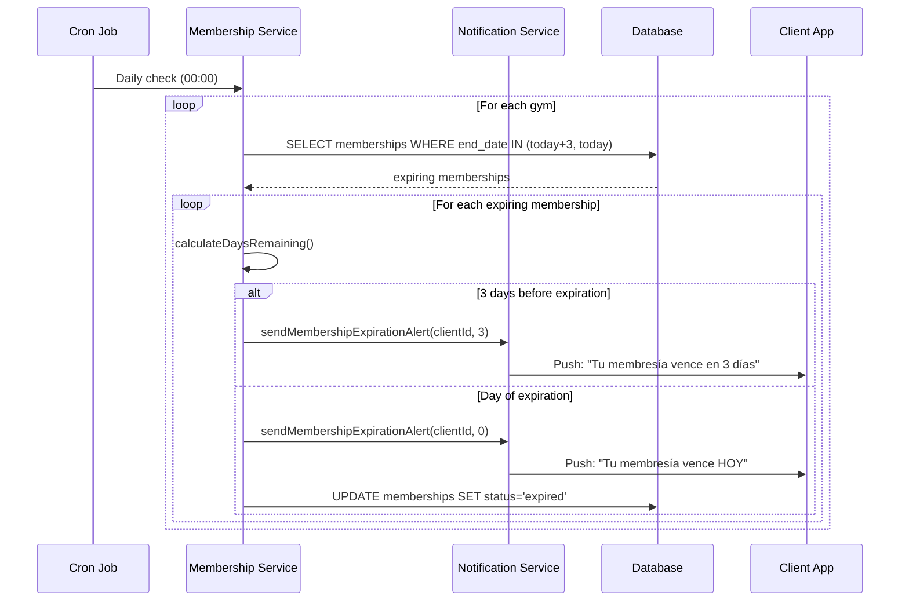
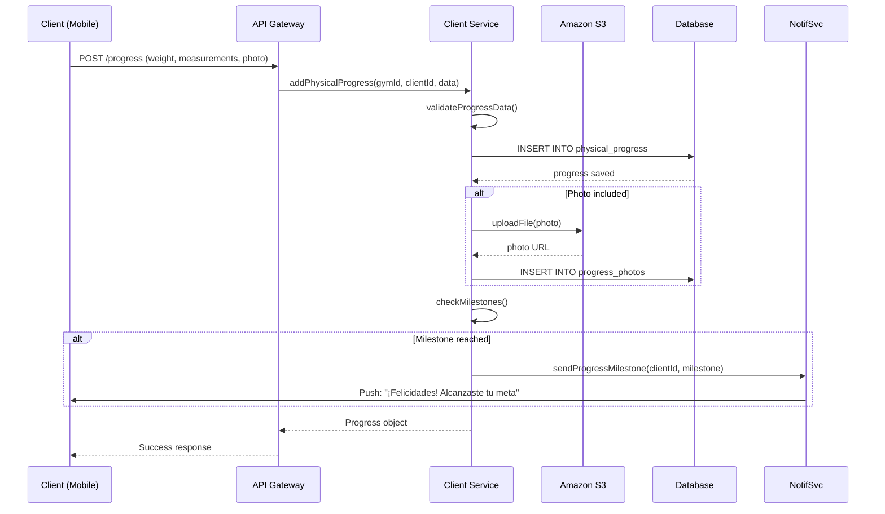
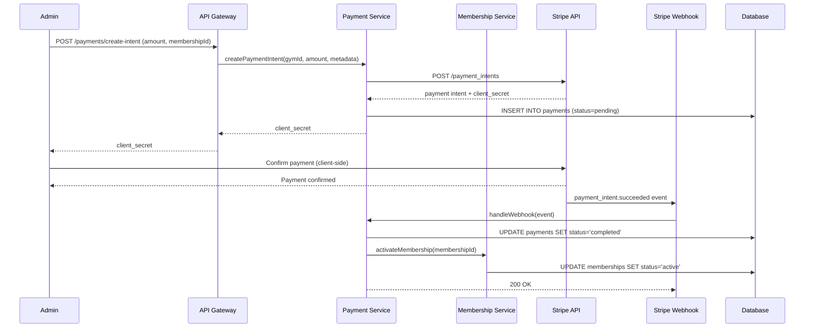

# Design Document: Gym Management SaaS

## Overview

Sistema SaaS multi-tenant para gestión integral de gimnasios con IA integrada. El sistema consta de dos productos principales: una plataforma web (dashboard) para administradores, entrenadores y recepcionistas, y una aplicación móvil para clientes del gimnasio. La arquitectura multi-tenant permite que múltiples gimnasios utilicen la misma infraestructura manteniendo sus datos completamente aislados mediante gym_id.

El sistema incluye gestión completa de clientes, control de membresías con alertas automáticas, generación de rutinas con IA, inventario de máquinas, estadísticas del gimnasio, sistema de promociones, y seguimiento de progreso para usuarios. La estrategia de desarrollo se divide en tres fases: MVP sin IA, integración de IA para rutinas, y funcionalidades avanzadas de pagos y promociones.

## Architecture

### High-Level System Architecture



### Multi-Tenant Architecture




### Deployment Architecture



## Components and Interfaces

### Component 1: Authentication Service

**Purpose**: Gestionar autenticación y autorización multi-tenant con JWT

**Interface**:
```typescript
interface AuthService {
  register(gymId: string, userData: RegisterDTO): Promise<AuthResult>
  login(email: string, password: string): Promise<AuthResult>
  validateToken(token: string): Promise<TokenPayload>
  refreshToken(refreshToken: string): Promise<AuthResult>
  logout(userId: string): Promise<void>
}

interface AuthResult {
  accessToken: string
  refreshToken: string
  user: UserProfile
  gymId: string
}

interface TokenPayload {
  userId: string
  gymId: string
  role: UserRole
  exp: number
}

enum UserRole {
  SUPER_ADMIN = 'super_admin',
  GYM_ADMIN = 'gym_admin',
  TRAINER = 'trainer',
  RECEPTIONIST = 'receptionist',
  CLIENT = 'client'
}
```


**Responsibilities**:
- Registro de usuarios con validación de gym_id
- Autenticación con JWT (access + refresh tokens)
- Validación de permisos basada en roles
- Gestión de sesiones y logout
- Aislamiento de datos por gimnasio

### Component 2: Client Management Service

**Purpose**: Gestión completa de clientes del gimnasio con datos personales, físicos e historial

**Interface**:
```typescript
interface ClientManagementService {
  createClient(gymId: string, clientData: CreateClientDTO): Promise<Client>
  updateClient(gymId: string, clientId: string, updates: UpdateClientDTO): Promise<Client>
  getClient(gymId: string, clientId: string): Promise<Client>
  listClients(gymId: string, filters: ClientFilters): Promise<PaginatedResult<Client>>
  suspendClient(gymId: string, clientId: string, reason: string): Promise<void>
  reactivateClient(gymId: string, clientId: string): Promise<void>
  
  // Progreso físico
  addPhysicalProgress(gymId: string, clientId: string, progress: PhysicalProgressDTO): Promise<PhysicalProgress>
  getProgressHistory(gymId: string, clientId: string, dateRange: DateRange): Promise<PhysicalProgress[]>
  
  // Fotos de progreso
  uploadProgressPhoto(gymId: string, clientId: string, photo: File): Promise<ProgressPhoto>
  getProgressPhotos(gymId: string, clientId: string): Promise<ProgressPhoto[]>
}

interface Client {
  id: string
  gymId: string
  personalData: PersonalData
  physicalData: PhysicalData
  goals: ClientGoals
  status: ClientStatus
  createdAt: Date
  updatedAt: Date
}

interface PersonalData {
  firstName: string
  lastName: string
  email: string
  phone: string
  dateOfBirth: Date
  gender: Gender
}

interface PhysicalData {
  weight: number
  height: number
  bmi: number
  bodyFatPercentage?: number
  measurements?: BodyMeasurements
}

interface BodyMeasurements {
  chest?: number
  waist?: number
  hips?: number
  arms?: number
  thighs?: number
}


interface ClientGoals {
  primary: GoalType
  targetWeight?: number
  targetDate?: Date
  notes?: string
}

enum GoalType {
  WEIGHT_LOSS = 'weight_loss',
  MUSCLE_GAIN = 'muscle_gain',
  MAINTENANCE = 'maintenance',
  STRENGTH = 'strength',
  ENDURANCE = 'endurance'
}

enum ClientStatus {
  ACTIVE = 'active',
  SUSPENDED = 'suspended',
  INACTIVE = 'inactive'
}

interface PhysicalProgress {
  id: string
  clientId: string
  gymId: string
  date: Date
  weight: number
  bodyFatPercentage?: number
  measurements?: BodyMeasurements
  notes?: string
}
```

**Responsibilities**:
- CRUD completo de clientes con validación de gym_id
- Gestión de datos personales y físicos
- Registro y seguimiento de progreso físico
- Gestión de fotos de progreso con almacenamiento en S3
- Cálculo automático de IMC
- Suspensión y reactivación de clientes

### Component 3: Membership Service

**Purpose**: Control crítico de membresías con automatizaciones y alertas

**Interface**:
```typescript
interface MembershipService {
  createMembership(gymId: string, membershipData: CreateMembershipDTO): Promise<Membership>
  renewMembership(gymId: string, membershipId: string, renewalData: RenewalDTO): Promise<Membership>
  cancelMembership(gymId: string, membershipId: string, reason: string): Promise<void>
  
  getMembership(gymId: string, membershipId: string): Promise<Membership>
  getClientMemberships(gymId: string, clientId: string): Promise<Membership[]>
  
  // Consultas críticas
  getActiveMemberships(gymId: string): Promise<Membership[]>
  getExpiringMemberships(gymId: string, daysAhead: number): Promise<Membership[]>
  getExpiredMemberships(gymId: string): Promise<Membership[]>
  
  // Alertas automáticas
  sendExpirationAlerts(gymId: string): Promise<AlertResult>
  
  // Estadísticas
  getMembershipStats(gymId: string, dateRange: DateRange): Promise<MembershipStats>
}


interface Membership {
  id: string
  gymId: string
  clientId: string
  type: MembershipType
  startDate: Date
  endDate: Date
  status: MembershipStatus
  price: number
  autoRenew: boolean
  paymentHistory: Payment[]
  createdAt: Date
  updatedAt: Date
}

enum MembershipType {
  MONTHLY = 'monthly',
  QUARTERLY = 'quarterly',
  ANNUAL = 'annual'
}

enum MembershipStatus {
  ACTIVE = 'active',
  EXPIRING_SOON = 'expiring_soon',
  EXPIRED = 'expired',
  CANCELLED = 'cancelled'
}

interface MembershipStats {
  totalActive: number
  totalExpired: number
  totalExpiringSoon: number
  revenueThisMonth: number
  newMembershipsThisMonth: number
  renewalRate: number
}
```

**Responsibilities**:
- Gestión completa de membresías (crear, renovar, cancelar)
- Control de estados: activos, por vencer, vencidos
- Sistema de alertas automáticas (3 días antes, día de vencimiento)
- Integración con sistema de pagos
- Cálculo de estadísticas de membresías
- Renovación rápida con un clic

### Component 4: Routine Service

**Purpose**: Gestión de rutinas de entrenamiento con creación manual o generación con IA

**Interface**:
```typescript
interface RoutineService {
  // Rutinas manuales
  createRoutine(gymId: string, routineData: CreateRoutineDTO): Promise<Routine>
  updateRoutine(gymId: string, routineId: string, updates: UpdateRoutineDTO): Promise<Routine>
  deleteRoutine(gymId: string, routineId: string): Promise<void>
  
  // Asignación
  assignRoutineToClient(gymId: string, routineId: string, clientId: string): Promise<Assignment>
  unassignRoutine(gymId: string, assignmentId: string): Promise<void>
  
  // Consultas
  getRoutine(gymId: string, routineId: string): Promise<Routine>
  getClientRoutine(gymId: string, clientId: string): Promise<Routine | null>
  listRoutines(gymId: string, filters: RoutineFilters): Promise<PaginatedResult<Routine>>
  
  // Generación con IA
  generateRoutineWithAI(gymId: string, params: AIRoutineParams): Promise<Routine>
}


interface Routine {
  id: string
  gymId: string
  name: string
  description: string
  targetGoal: GoalType
  difficulty: DifficultyLevel
  durationWeeks: number
  weeklySchedule: WeeklySchedule
  createdBy: string
  isAIGenerated: boolean
  createdAt: Date
  updatedAt: Date
}

interface WeeklySchedule {
  [day: string]: WorkoutDay
}

interface WorkoutDay {
  name: string
  exercises: Exercise[]
}

interface Exercise {
  id: string
  name: string
  sets: number
  reps: number | string
  restSeconds: number
  notes?: string
  videoUrl?: string
  muscleGroups: MuscleGroup[]
}

enum DifficultyLevel {
  BEGINNER = 'beginner',
  INTERMEDIATE = 'intermediate',
  ADVANCED = 'advanced'
}

enum MuscleGroup {
  CHEST = 'chest',
  BACK = 'back',
  SHOULDERS = 'shoulders',
  ARMS = 'arms',
  LEGS = 'legs',
  CORE = 'core',
  CARDIO = 'cardio'
}

interface AIRoutineParams {
  clientId: string
  clientData: {
    age: number
    weight: number
    height: number
    goal: GoalType
    experienceLevel: DifficultyLevel
    injuries?: string[]
    daysPerWeek: number
  }
  gymEquipment: string[]
}
```

**Responsibilities**:
- Creación y edición manual de rutinas
- Asignación de rutinas a clientes
- Almacenamiento de videos demostrativos en S3
- Integración con servicio de IA para generación automática
- Gestión de biblioteca de ejercicios
- Validación de rutinas según equipamiento disponible


### Component 5: AI Routine Generator Service

**Purpose**: Generación inteligente de rutinas personalizadas usando OpenAI o modelos open source

**Interface**:
```typescript
interface AIRoutineGeneratorService {
  generateRoutine(params: AIRoutineParams): Promise<GeneratedRoutine>
  validateRoutine(routine: GeneratedRoutine): Promise<ValidationResult>
  adjustRoutine(routineId: string, feedback: RoutineFeedback): Promise<GeneratedRoutine>
}

interface GeneratedRoutine {
  name: string
  description: string
  weeklySchedule: WeeklySchedule
  rationale: string
  estimatedCaloriesBurn: number
  progressionPlan: string
}

interface ValidationResult {
  isValid: boolean
  warnings: string[]
  suggestions: string[]
}

interface RoutineFeedback {
  tooEasy?: boolean
  tooHard?: boolean
  exercisesToReplace?: string[]
  preferredMuscleGroups?: MuscleGroup[]
}
```

**Responsibilities**:
- Generación de rutinas personalizadas basadas en datos del cliente
- Consideración de equipamiento disponible en el gimnasio
- Adaptación según lesiones y limitaciones
- Validación de rutinas generadas
- Ajuste de rutinas según feedback
- Integración con OpenAI API o modelos alternativos

### Component 6: Inventory Service

**Purpose**: Gestión de inventario de máquinas y equipamiento del gimnasio

**Interface**:
```typescript
interface InventoryService {
  addEquipment(gymId: string, equipmentData: CreateEquipmentDTO): Promise<Equipment>
  updateEquipment(gymId: string, equipmentId: string, updates: UpdateEquipmentDTO): Promise<Equipment>
  deleteEquipment(gymId: string, equipmentId: string): Promise<void>
  
  getEquipment(gymId: string, equipmentId: string): Promise<Equipment>
  listEquipment(gymId: string, filters: EquipmentFilters): Promise<PaginatedResult<Equipment>>
  
  // Mantenimiento
  recordMaintenance(gymId: string, equipmentId: string, maintenance: MaintenanceRecord): Promise<void>
  getMaintenanceHistory(gymId: string, equipmentId: string): Promise<MaintenanceRecord[]>
  getEquipmentDueMaintenance(gymId: string): Promise<Equipment[]>
}


interface Equipment {
  id: string
  gymId: string
  name: string
  brand: string
  category: EquipmentCategory
  purchaseDate: Date
  status: EquipmentStatus
  maintenanceSchedule: MaintenanceSchedule
  maintenanceHistory: MaintenanceRecord[]
  notes?: string
  createdAt: Date
  updatedAt: Date
}

enum EquipmentCategory {
  CARDIO = 'cardio',
  STRENGTH = 'strength',
  FREE_WEIGHTS = 'free_weights',
  FUNCTIONAL = 'functional',
  ACCESSORIES = 'accessories'
}

enum EquipmentStatus {
  OPERATIONAL = 'operational',
  MAINTENANCE = 'maintenance',
  DAMAGED = 'damaged',
  OUT_OF_SERVICE = 'out_of_service'
}

interface MaintenanceSchedule {
  frequencyDays: number
  lastMaintenance: Date
  nextMaintenance: Date
}

interface MaintenanceRecord {
  date: Date
  type: MaintenanceType
  description: string
  cost?: number
  performedBy: string
}

enum MaintenanceType {
  ROUTINE = 'routine',
  REPAIR = 'repair',
  REPLACEMENT = 'replacement'
}
```

**Responsibilities**:
- Registro completo de máquinas y equipamiento
- Control de estado y disponibilidad
- Gestión de mantenimientos programados
- Historial de reparaciones y reemplazos
- Alertas de mantenimiento pendiente
- Integración con generador de rutinas (equipamiento disponible)

### Component 7: Statistics Service

**Purpose**: Dashboard de estadísticas y métricas del gimnasio

**Interface**:
```typescript
interface StatisticsService {
  getDashboardStats(gymId: string, dateRange: DateRange): Promise<DashboardStats>
  getRevenueReport(gymId: string, dateRange: DateRange): Promise<RevenueReport>
  getClientRetentionReport(gymId: string, dateRange: DateRange): Promise<RetentionReport>
  getMembershipTrends(gymId: string, months: number): Promise<TrendData[]>
  getClientGrowth(gymId: string, months: number): Promise<GrowthData[]>
}


interface DashboardStats {
  activeClients: number
  revenueThisMonth: number
  membershipsSold: number
  newClientsThisMonth: number
  retentionRate: number
  averageClientLifetime: number
  equipmentOperational: number
  equipmentNeedsMaintenance: number
}

interface RevenueReport {
  totalRevenue: number
  revenueByMembershipType: Record<MembershipType, number>
  revenueByMonth: MonthlyRevenue[]
  projectedRevenue: number
}

interface RetentionReport {
  retentionRate: number
  churnRate: number
  averageLifetimeValue: number
  clientsByTenure: TenureDistribution
}

interface TrendData {
  month: string
  value: number
  change: number
}

interface GrowthData {
  month: string
  newClients: number
  lostClients: number
  netGrowth: number
}
```

**Responsibilities**:
- Cálculo de métricas clave del gimnasio
- Generación de reportes de ingresos
- Análisis de retención de clientes
- Tendencias de membresías
- Proyecciones de crecimiento
- Cache de estadísticas para rendimiento

### Component 8: Promotions Service

**Purpose**: Gestión de promociones y descuentos para membresías

**Interface**:
```typescript
interface PromotionsService {
  createPromotion(gymId: string, promotionData: CreatePromotionDTO): Promise<Promotion>
  updatePromotion(gymId: string, promotionId: string, updates: UpdatePromotionDTO): Promise<Promotion>
  deletePromotion(gymId: string, promotionId: string): Promise<void>
  
  getPromotion(gymId: string, promotionId: string): Promise<Promotion>
  listActivePromotions(gymId: string): Promise<Promotion[]>
  
  applyPromotion(gymId: string, promotionCode: string, membershipData: MembershipData): Promise<DiscountResult>
  validatePromotion(gymId: string, promotionCode: string): Promise<ValidationResult>
}


interface Promotion {
  id: string
  gymId: string
  name: string
  code: string
  type: PromotionType
  discountType: DiscountType
  discountValue: number
  startDate: Date
  endDate: Date
  maxUses?: number
  currentUses: number
  applicableMembershipTypes: MembershipType[]
  isActive: boolean
  createdAt: Date
}

enum PromotionType {
  SIGNUP = 'signup',
  RENEWAL = 'renewal',
  REFERRAL = 'referral',
  SEASONAL = 'seasonal'
}

enum DiscountType {
  PERCENTAGE = 'percentage',
  FIXED_AMOUNT = 'fixed_amount'
}

interface DiscountResult {
  originalPrice: number
  discountAmount: number
  finalPrice: number
  promotionApplied: string
}
```

**Responsibilities**:
- Creación y gestión de promociones
- Validación de códigos promocionales
- Aplicación de descuentos a membresías
- Control de límites de uso
- Promociones por referidos
- Seguimiento de efectividad de promociones

### Component 9: Payment Service

**Purpose**: Integración con Stripe y SINPE móvil para procesamiento de pagos

**Interface**:
```typescript
interface PaymentService {
  // Stripe
  createPaymentIntent(gymId: string, amount: number, metadata: PaymentMetadata): Promise<PaymentIntent>
  confirmPayment(gymId: string, paymentIntentId: string): Promise<Payment>
  
  // SINPE móvil
  recordSINPEPayment(gymId: string, paymentData: SINPEPaymentDTO): Promise<Payment>
  
  // Consultas
  getPayment(gymId: string, paymentId: string): Promise<Payment>
  getClientPayments(gymId: string, clientId: string): Promise<Payment[]>
  getPaymentHistory(gymId: string, dateRange: DateRange): Promise<Payment[]>
  
  // Reembolsos
  refundPayment(gymId: string, paymentId: string, amount?: number): Promise<Refund>
}


interface Payment {
  id: string
  gymId: string
  clientId: string
  membershipId: string
  amount: number
  currency: string
  method: PaymentMethod
  status: PaymentStatus
  stripePaymentIntentId?: string
  sinpeReference?: string
  metadata: PaymentMetadata
  createdAt: Date
}

enum PaymentMethod {
  CREDIT_CARD = 'credit_card',
  DEBIT_CARD = 'debit_card',
  SINPE_MOVIL = 'sinpe_movil',
  CASH = 'cash'
}

enum PaymentStatus {
  PENDING = 'pending',
  COMPLETED = 'completed',
  FAILED = 'failed',
  REFUNDED = 'refunded'
}

interface PaymentMetadata {
  membershipType: MembershipType
  promotionCode?: string
  notes?: string
}
```

**Responsibilities**:
- Procesamiento de pagos con tarjeta vía Stripe
- Registro de pagos SINPE móvil
- Gestión de pagos en efectivo
- Historial de transacciones
- Procesamiento de reembolsos
- Webhooks de Stripe para confirmaciones

### Component 10: Notification Service

**Purpose**: Envío de notificaciones push y alertas automáticas

**Interface**:
```typescript
interface NotificationService {
  sendPushNotification(userId: string, notification: PushNotification): Promise<void>
  sendBulkNotifications(userIds: string[], notification: PushNotification): Promise<void>
  
  // Alertas automáticas
  sendMembershipExpirationAlert(gymId: string, clientId: string, daysRemaining: number): Promise<void>
  sendWorkoutReminder(gymId: string, clientId: string): Promise<void>
  sendProgressMilestone(gymId: string, clientId: string, milestone: Milestone): Promise<void>
  
  // Configuración
  updateNotificationPreferences(userId: string, preferences: NotificationPreferences): Promise<void>
  getNotificationHistory(userId: string): Promise<NotificationRecord[]>
}

interface PushNotification {
  title: string
  body: string
  data?: Record<string, any>
  priority: NotificationPriority
}

enum NotificationPriority {
  LOW = 'low',
  NORMAL = 'normal',
  HIGH = 'high'
}
```

**Responsibilities**:
- Envío de notificaciones push a app móvil
- Alertas automáticas de vencimiento de membresías
- Recordatorios de entrenamiento
- Notificaciones de progreso
- Gestión de preferencias de usuario
- Historial de notificaciones enviadas


## Data Models

### Database Schema Overview



### Multi-Tenant Data Isolation

**Estrategia**: Todas las tablas principales incluyen `gym_id` como clave foránea

**Reglas de aislamiento**:
1. Todas las consultas DEBEN incluir filtro por `gym_id`
2. Los índices compuestos DEBEN incluir `gym_id` como primera columna
3. Las validaciones DEBEN verificar que el usuario pertenece al gym_id solicitado
4. Los JOINs entre tablas DEBEN incluir condición de `gym_id`

**Índices críticos**:
```sql
CREATE INDEX idx_clients_gym_id ON clients(gym_id, status);
CREATE INDEX idx_memberships_gym_id_status ON memberships(gym_id, status, end_date);
CREATE INDEX idx_routines_gym_id ON routines(gym_id);
CREATE INDEX idx_equipment_gym_id_status ON equipment(gym_id, status);
CREATE INDEX idx_payments_gym_id_client ON payments(gym_id, client_id, created_at);
```

### Validation Rules

**Clients**:
- Email debe ser único por gym_id
- Peso debe ser > 0 y < 500 kg
- Altura debe ser > 0 y < 300 cm
- IMC se calcula automáticamente: weight / (height^2)
- Edad debe ser >= 16 años

**Memberships**:
- end_date debe ser posterior a start_date
- Precio debe ser > 0
- No puede haber membresías activas superpuestas para el mismo cliente
- Status se actualiza automáticamente según end_date

**Routines**:
- Debe tener al menos 1 día de entrenamiento
- Cada ejercicio debe tener sets > 0 y reps > 0
- Videos deben estar en formato MP4 o MOV
- Duración en semanas debe ser entre 1 y 52

**Equipment**:
- next_maintenance se calcula automáticamente: last_maintenance + maintenance_frequency_days
- Status se actualiza a 'maintenance' cuando next_maintenance <= hoy

**Promotions**:
- code debe ser único por gym_id
- discount_value debe ser > 0
- Si discount_type es 'percentage', discount_value debe ser <= 100
- end_date debe ser posterior a start_date


## Key Workflows

### Workflow 1: Client Registration and Membership Creation



### Workflow 2: AI Routine Generation and Assignment




### Workflow 3: Automated Membership Expiration Alerts



### Workflow 4: Client Progress Tracking (Mobile App)




### Workflow 5: Payment Processing with Stripe



## Error Handling

### Error Scenario 1: Multi-Tenant Data Isolation Violation

**Condition**: Usuario intenta acceder a datos de otro gimnasio
**Response**: 
- Validar gym_id del token JWT contra gym_id del recurso solicitado
- Retornar 403 Forbidden si no coinciden
- Registrar intento en logs de seguridad
**Recovery**: Usuario debe autenticarse con credenciales correctas del gimnasio

### Error Scenario 2: Membership Overlap Detection

**Condition**: Intento de crear membresía que se superpone con una activa
**Response**:
- Validar fechas contra membresías existentes del cliente
- Retornar 409 Conflict con detalles de la membresía existente
- Sugerir fecha de inicio válida
**Recovery**: Ajustar fechas o cancelar membresía existente primero

### Error Scenario 3: AI Routine Generation Failure

**Condition**: OpenAI API falla o retorna respuesta inválida
**Response**:
- Implementar retry con exponential backoff (3 intentos)
- Si falla, retornar 503 Service Unavailable
- Registrar error con detalles del prompt
- Ofrecer opción de crear rutina manual
**Recovery**: Usuario puede reintentar o crear rutina manualmente

### Error Scenario 4: Payment Processing Failure

**Condition**: Stripe rechaza el pago
**Response**:
- Capturar error de Stripe con código específico
- Actualizar payment status a 'failed'
- Retornar 402 Payment Required con mensaje descriptivo
- No activar membresía
**Recovery**: Usuario debe intentar con otro método de pago

### Error Scenario 5: File Upload Failure (S3)

**Condition**: Falla al subir video o foto a S3
**Response**:
- Implementar retry (2 intentos)
- Si falla, retornar 500 Internal Server Error
- Guardar registro sin URL de archivo
- Permitir re-upload posterior
**Recovery**: Usuario puede reintentar upload desde la interfaz


### Error Scenario 6: Database Connection Pool Exhaustion

**Condition**: Todas las conexiones de PostgreSQL están en uso
**Response**:
- Implementar connection pooling con límites (max 20 conexiones)
- Queue de requests con timeout de 5 segundos
- Retornar 503 Service Unavailable si timeout
- Liberar conexiones automáticamente después de cada query
**Recovery**: Sistema se recupera automáticamente cuando se liberan conexiones

## Testing Strategy

### Unit Testing Approach

**Framework**: Jest para backend (NestJS), React Testing Library para frontend

**Cobertura objetivo**: 80% de code coverage

**Áreas críticas a testear**:
- Validación de datos multi-tenant (gym_id en todas las queries)
- Cálculos: IMC, fechas de vencimiento, descuentos
- Lógica de negocio: overlap de membresías, validación de rutinas
- Transformaciones de datos para IA

**Ejemplos de tests unitarios**:
```typescript
describe('ClientService', () => {
  it('should calculate BMI correctly', () => {
    const bmi = calculateBMI(70, 1.75); // 70kg, 1.75m
    expect(bmi).toBeCloseTo(22.86, 2);
  });
  
  it('should reject client creation without gym_id', async () => {
    await expect(
      clientService.createClient(null, clientData)
    ).rejects.toThrow('gym_id is required');
  });
  
  it('should isolate clients by gym_id', async () => {
    const gym1Clients = await clientService.listClients('gym-1', {});
    const gym2Clients = await clientService.listClients('gym-2', {});
    
    expect(gym1Clients.every(c => c.gymId === 'gym-1')).toBe(true);
    expect(gym2Clients.every(c => c.gymId === 'gym-2')).toBe(true);
  });
});

describe('MembershipService', () => {
  it('should detect overlapping memberships', async () => {
    const existing = { startDate: '2024-01-01', endDate: '2024-02-01' };
    const newMembership = { startDate: '2024-01-15', endDate: '2024-02-15' };
    
    await expect(
      membershipService.createMembership(gymId, newMembership)
    ).rejects.toThrow('Membership overlap detected');
  });
  
  it('should calculate expiring memberships correctly', async () => {
    const expiring = await membershipService.getExpiringMemberships(gymId, 3);
    
    expiring.forEach(m => {
      const daysUntilExpiry = daysBetween(new Date(), m.endDate);
      expect(daysUntilExpiry).toBeLessThanOrEqual(3);
    });
  });
});
```

### Property-Based Testing Approach

**Framework**: fast-check (JavaScript/TypeScript)

**Propiedades a testear**:

1. **Multi-tenant isolation**: Para cualquier gym_id, las queries nunca deben retornar datos de otro gym_id
2. **BMI calculation**: Para cualquier peso y altura válidos, BMI debe estar en rango razonable (10-60)
3. **Date calculations**: end_date siempre debe ser posterior a start_date
4. **Discount calculations**: Precio final nunca debe ser negativo
5. **Membership status**: Status debe ser consistente con end_date

**Ejemplo de property test**:
```typescript
import fc from 'fast-check';

describe('Property-Based Tests', () => {
  it('BMI should always be positive for valid inputs', () => {
    fc.assert(
      fc.property(
        fc.float({ min: 30, max: 300 }), // weight in kg
        fc.float({ min: 1.0, max: 2.5 }), // height in meters
        (weight, height) => {
          const bmi = calculateBMI(weight, height);
          return bmi > 0 && bmi < 100;
        }
      )
    );
  });
  
  it('Discount should never result in negative price', () => {
    fc.assert(
      fc.property(
        fc.float({ min: 10, max: 1000 }), // original price
        fc.float({ min: 0, max: 100 }), // discount percentage
        (price, discount) => {
          const finalPrice = applyDiscount(price, discount, 'percentage');
          return finalPrice >= 0;
        }
      )
    );
  });
});
```

### Integration Testing Approach

**Framework**: Supertest para API testing, Testcontainers para PostgreSQL

**Áreas a testear**:
- Flujos completos end-to-end (registro → membresía → pago)
- Integración con servicios externos (mocks de Stripe, OpenAI, S3)
- Webhooks de Stripe
- Cron jobs de alertas
- Multi-tenant data isolation en queries complejas

**Ejemplo de integration test**:
```typescript
describe('Client Registration Flow', () => {
  it('should create client, membership, and process payment', async () => {
    // 1. Create client
    const clientRes = await request(app)
      .post('/api/clients')
      .set('Authorization', `Bearer ${gymAdminToken}`)
      .send(clientData)
      .expect(201);
    
    const clientId = clientRes.body.id;
    
    // 2. Create membership
    const membershipRes = await request(app)
      .post('/api/memberships')
      .set('Authorization', `Bearer ${gymAdminToken}`)
      .send({ clientId, type: 'monthly', price: 50 })
      .expect(201);
    
    const membershipId = membershipRes.body.id;
    
    // 3. Process payment
    const paymentRes = await request(app)
      .post('/api/payments/create-intent')
      .set('Authorization', `Bearer ${gymAdminToken}`)
      .send({ membershipId, amount: 50 })
      .expect(200);
    
    expect(paymentRes.body.clientSecret).toBeDefined();
    
    // 4. Verify membership is active after payment
    const membership = await membershipService.getMembership(gymId, membershipId);
    expect(membership.status).toBe('active');
  });
});
```


## Performance Considerations

### Database Optimization

**Indexing Strategy**:
- Índices compuestos con gym_id como primera columna para todas las tablas
- Índices en columnas de fecha para queries de rango (end_date, created_at)
- Índices en columnas de status para filtros frecuentes

**Query Optimization**:
- Usar SELECT específico en lugar de SELECT *
- Implementar paginación en todas las listas (limit/offset)
- Usar EXPLAIN ANALYZE para identificar queries lentas
- Considerar materialized views para estadísticas complejas

**Connection Pooling**:
- Pool size: 20 conexiones máximo
- Idle timeout: 30 segundos
- Connection timeout: 5 segundos

### Caching Strategy

**Redis Cache**:
- Cache de estadísticas del dashboard (TTL: 5 minutos)
- Cache de lista de equipamiento (TTL: 1 hora)
- Cache de rutinas asignadas (TTL: 30 minutos)
- Cache de datos de cliente para app móvil (TTL: 15 minutos)

**Cache Invalidation**:
- Invalidar cache de estadísticas al crear/actualizar membresías o pagos
- Invalidar cache de equipamiento al actualizar estado
- Invalidar cache de rutinas al asignar/modificar

### File Storage Optimization

**S3 Strategy**:
- Usar CloudFront CDN para videos de ejercicios
- Comprimir imágenes antes de subir (max 2MB)
- Usar signed URLs con expiración de 1 hora
- Organizar por gym_id: `s3://bucket/{gym_id}/videos/`, `s3://bucket/{gym_id}/photos/`

**Video Optimization**:
- Formato: MP4 con H.264 codec
- Resolución máxima: 1080p
- Bitrate: 2-4 Mbps
- Generar thumbnails automáticamente

### API Rate Limiting

**Límites por endpoint**:
- Endpoints públicos: 100 requests/minuto por IP
- Endpoints autenticados: 1000 requests/minuto por usuario
- AI generation: 10 requests/hora por gimnasio (costoso)
- File uploads: 50 requests/hora por usuario

### Scalability Considerations

**Horizontal Scaling**:
- Aplicación stateless para permitir múltiples instancias
- Load balancer con health checks
- Session storage en Redis (no en memoria)

**Database Scaling**:
- Read replicas para queries de solo lectura (estadísticas, reportes)
- Particionamiento por gym_id si se supera 1000 gimnasios
- Considerar sharding geográfico en el futuro

**Estimación de carga** (10 gimnasios, 100 clientes cada uno):
- Usuarios concurrentes: ~50-100
- Requests/segundo: ~10-20
- Database queries/segundo: ~50-100
- Storage: ~50GB (videos + fotos)

## Security Considerations

### Authentication & Authorization

**JWT Strategy**:
- Access token: 15 minutos de expiración
- Refresh token: 7 días de expiración
- Tokens almacenados en httpOnly cookies (web) o secure storage (mobile)
- Rotación de refresh tokens en cada uso

**Role-Based Access Control (RBAC)**:
- SUPER_ADMIN: Gestión de gimnasios, configuración global
- GYM_ADMIN: Acceso completo a datos del gimnasio
- TRAINER: Gestión de clientes, rutinas, progreso
- RECEPTIONIST: Gestión de clientes, membresías, pagos
- CLIENT: Solo acceso a sus propios datos

**Permission Matrix**:
```
| Resource      | SUPER_ADMIN | GYM_ADMIN | TRAINER | RECEPTIONIST | CLIENT |
|---------------|-------------|-----------|---------|--------------|--------|
| Gyms          | CRUD        | R         | -       | -            | -      |
| Clients       | CRUD        | CRUD      | CRUD    | CRUD         | R(own) |
| Memberships   | CRUD        | CRUD      | R       | CRUD         | R(own) |
| Routines      | CRUD        | CRUD      | CRUD    | R            | R(own) |
| Equipment     | CRUD        | CRUD      | R       | R            | -      |
| Payments      | CRUD        | CRUD      | R       | CRUD         | R(own) |
| Statistics    | R(all)      | R(gym)    | R(gym)  | R(gym)       | -      |
| AI Generation | -           | Use       | Use     | -            | -      |
```

### Data Protection

**Encryption**:
- Passwords: bcrypt con salt rounds = 12
- Datos sensibles en DB: Encriptar campos de tarjetas (si se almacenan)
- Comunicación: HTTPS/TLS 1.3 obligatorio
- Tokens: Firmados con RS256 (asymmetric)

**PII Protection**:
- Minimizar datos personales almacenados
- No almacenar números de tarjeta completos (usar Stripe tokens)
- Logs no deben contener PII
- Implementar derecho al olvido (GDPR compliance)

**Multi-Tenant Security**:
- Validar gym_id en TODAS las queries
- Middleware de validación de tenant en cada request
- Auditoría de intentos de acceso cross-tenant
- Tests automatizados de aislamiento de datos

### API Security

**Input Validation**:
- Validar todos los inputs con class-validator (NestJS)
- Sanitizar inputs para prevenir SQL injection
- Validar tipos, rangos, formatos
- Rate limiting por endpoint

**CORS Configuration**:
- Whitelist de dominios permitidos
- Credentials: true para cookies
- Métodos permitidos: GET, POST, PUT, DELETE, PATCH

**Security Headers**:
```typescript
helmet({
  contentSecurityPolicy: true,
  crossOriginEmbedderPolicy: true,
  crossOriginOpenerPolicy: true,
  crossOriginResourcePolicy: true,
  dnsPrefetchControl: true,
  frameguard: true,
  hidePoweredBy: true,
  hsts: true,
  ieNoOpen: true,
  noSniff: true,
  referrerPolicy: true,
  xssFilter: true
})
```

### Third-Party Security

**Stripe**:
- Usar Stripe Elements para captura de tarjetas (PCI compliance)
- Validar webhooks con signature verification
- No almacenar datos de tarjetas en nuestra DB
- Usar Stripe Customer IDs para referencias

**OpenAI**:
- API keys en variables de entorno
- Rate limiting estricto
- Validar y sanitizar outputs de IA
- Timeout de 30 segundos en requests

**S3**:
- Bucket privado con acceso solo vía signed URLs
- Políticas de IAM restrictivas
- Encriptación en reposo (AES-256)
- Versionado habilitado para recuperación

### Audit Logging

**Eventos a registrar**:
- Autenticación: login, logout, failed attempts
- Cambios críticos: creación/cancelación de membresías, pagos
- Acceso a datos sensibles: visualización de datos de clientes
- Intentos de acceso cross-tenant
- Cambios de configuración del gimnasio

**Log Format**:
```json
{
  "timestamp": "2024-01-15T10:30:00Z",
  "userId": "uuid",
  "gymId": "uuid",
  "action": "membership.create",
  "resource": "membership:uuid",
  "ipAddress": "192.168.1.1",
  "userAgent": "Mozilla/5.0...",
  "result": "success"
}
```


## Dependencies

### Backend Dependencies

**Core Framework**:
- Node.js v20 LTS
- NestJS v10 (framework principal)
- TypeScript v5

**Database**:
- PostgreSQL v15 (base de datos principal)
- TypeORM v0.3 (ORM)
- pg (PostgreSQL driver)

**Authentication**:
- @nestjs/jwt (JWT tokens)
- @nestjs/passport (authentication strategies)
- bcrypt (password hashing)

**Caching**:
- Redis v7
- ioredis (Redis client)
- @nestjs/cache-manager

**File Storage**:
- @aws-sdk/client-s3 (S3 integration)
- multer (file upload handling)
- sharp (image processing)

**Payment Processing**:
- stripe (Stripe SDK)

**AI Integration**:
- openai (OpenAI SDK)
- Alternativa: @huggingface/inference (modelos open source)

**Validation & Transformation**:
- class-validator (input validation)
- class-transformer (DTO transformation)

**Testing**:
- Jest (unit & integration testing)
- @nestjs/testing
- supertest (API testing)
- fast-check (property-based testing)
- testcontainers (PostgreSQL containers para tests)

**Monitoring & Logging**:
- winston (logging)
- @nestjs/terminus (health checks)
- prom-client (Prometheus metrics)

**Utilities**:
- date-fns (date manipulation)
- uuid (UUID generation)
- helmet (security headers)
- @nestjs/throttler (rate limiting)

### Frontend Dependencies (Web Dashboard)

**Core Framework**:
- React v18
- Next.js v14 (SSR & routing)
- TypeScript v5

**State Management**:
- Zustand o Redux Toolkit

**UI Components**:
- Tailwind CSS (styling)
- shadcn/ui (component library)
- Recharts (gráficas y estadísticas)

**Forms & Validation**:
- React Hook Form
- Zod (schema validation)

**API Client**:
- Axios o TanStack Query (React Query)

**Date Handling**:
- date-fns

**Testing**:
- Jest
- React Testing Library
- Playwright (E2E testing)

### Mobile Dependencies (React Native)

**Core Framework**:
- React Native v0.73
- TypeScript v5

**Navigation**:
- React Navigation v6

**State Management**:
- Zustand o Redux Toolkit

**UI Components**:
- React Native Paper o NativeBase

**API Client**:
- Axios
- TanStack Query

**Push Notifications**:
- @react-native-firebase/messaging (Firebase Cloud Messaging)
- react-native-push-notification

**Media**:
- react-native-image-picker (fotos)
- react-native-video (videos de ejercicios)

**Storage**:
- @react-native-async-storage/async-storage

**Charts**:
- react-native-chart-kit (gráficas de progreso)

**Testing**:
- Jest
- React Native Testing Library
- Detox (E2E testing)

### Infrastructure Dependencies

**Hosting**:
- DigitalOcean Droplets (app servers)
- DigitalOcean Managed PostgreSQL
- DigitalOcean Managed Redis

**Storage**:
- Amazon S3 (videos e imágenes)
- CloudFront (CDN para videos)

**External Services**:
- Stripe (pagos)
- OpenAI API (generación de rutinas)
- Firebase Cloud Messaging (push notifications)

**DevOps**:
- Docker (containerization)
- GitHub Actions (CI/CD)
- Nginx (reverse proxy)
- PM2 (process manager)

**Monitoring**:
- Sentry (error tracking)
- Prometheus + Grafana (metrics)
- LogDNA o CloudWatch (logs)

### Development Tools

- ESLint + Prettier (code formatting)
- Husky (git hooks)
- Commitlint (commit message validation)
- TypeScript ESLint
- Jest coverage reports

## Development Phases

### Phase 1: MVP (Versión 1) - 8-10 semanas

**Objetivo**: Sistema funcional básico sin IA

**Módulos incluidos**:
- ✅ Autenticación multi-tenant
- ✅ Gestión de clientes (CRUD completo)
- ✅ Control de membresías (sin alertas automáticas)
- ✅ Rutinas manuales (sin IA)
- ✅ Dashboard web básico
- ✅ App móvil básica (perfil, rutina, progreso)
- ✅ Pagos en efectivo (sin Stripe)

**Entregables**:
- Backend API funcional con endpoints principales
- Dashboard web con módulos básicos
- App móvil con funcionalidad core
- Base de datos PostgreSQL configurada
- Autenticación JWT implementada
- Tests unitarios (cobertura 60%)

**Tareas Jira**:
1. Setup de proyecto y arquitectura base
2. Implementación de autenticación multi-tenant
3. Módulo de gestión de clientes
4. Módulo de membresías básico
5. Módulo de rutinas manuales
6. Dashboard web - UI/UX
7. App móvil - Pantallas principales
8. Integración backend-frontend
9. Testing y QA
10. Deployment en DigitalOcean

### Phase 2: AI Integration (Versión 2) - 4-6 semanas

**Objetivo**: Agregar generación inteligente de rutinas

**Módulos incluidos**:
- ✅ Integración con OpenAI API
- ✅ Generador de rutinas con IA
- ✅ Inventario de máquinas (para contexto de IA)
- ✅ Validación y ajuste de rutinas generadas
- ✅ Interfaz de generación en dashboard
- ✅ Visualización de rutinas IA en app móvil

**Entregables**:
- Servicio de IA integrado
- Módulo de inventario de equipamiento
- Prompts optimizados para OpenAI
- Sistema de validación de rutinas
- UI para generación de rutinas
- Tests de integración con IA

**Tareas Jira**:
1. Diseño de prompts para OpenAI
2. Implementación de AI Routine Generator Service
3. Módulo de inventario de máquinas
4. Integración de equipamiento con generador IA
5. UI de generación de rutinas en dashboard
6. Validación y ajuste de rutinas
7. Testing de generación de rutinas
8. Optimización de costos de API
9. Documentación de uso de IA
10. Deployment de versión 2

### Phase 3: Advanced Features (Versión 3) - 6-8 semanas

**Objetivo**: Funcionalidades avanzadas y monetización completa

**Módulos incluidos**:
- ✅ Integración completa con Stripe
- ✅ Integración con SINPE móvil
- ✅ Sistema de promociones
- ✅ Alertas automáticas de membresías
- ✅ Estadísticas avanzadas del gimnasio
- ✅ Notificaciones push
- ✅ Gestión completa de inventario con mantenimientos
- ✅ Reportes y exportación de datos

**Entregables**:
- Integración completa de pagos
- Sistema de promociones funcional
- Cron jobs de alertas automáticas
- Dashboard de estadísticas avanzado
- Sistema de notificaciones push
- Módulo de mantenimiento de equipamiento
- Generación de reportes PDF
- Tests end-to-end completos

**Tareas Jira**:
1. Integración con Stripe (pagos con tarjeta)
2. Implementación de SINPE móvil
3. Sistema de promociones y descuentos
4. Cron jobs de alertas automáticas
5. Dashboard de estadísticas avanzadas
6. Sistema de notificaciones push (FCM)
7. Módulo de mantenimiento de equipamiento
8. Generación de reportes PDF
9. Optimización de rendimiento
10. Testing completo y QA
11. Documentación final
12. Deployment de versión 3

### Phase 4: Future Enhancements (Roadmap)

**Potenciales mejoras**:
- White-label: Gimnasios con su propia marca
- Chat con entrenador en tiempo real
- Rutinas en casa con videos propios
- Integración con wearables (Apple Watch, Fitbit)
- Análisis predictivo de retención
- Marketplace de rutinas
- Clases grupales y reservas
- Sistema de referidos automatizado
- Multi-idioma (inglés, portugués)
- Expansión a otros países de LATAM

## Cost Estimation

### Infrastructure Costs (Monthly)

**Para 10 gimnasios, 1000 usuarios totales**:

| Servicio | Especificación | Costo Mensual |
|----------|----------------|---------------|
| DigitalOcean Droplet | 2 vCPU, 4GB RAM | $40 |
| PostgreSQL Managed | 2GB RAM, 25GB storage | $30 |
| Redis Managed | 1GB RAM | $15 |
| Amazon S3 | 100GB storage, 500GB transfer | $10 |
| CloudFront CDN | 500GB transfer | $20 |
| Stripe | 2.9% + $0.30 por transacción | Variable |
| OpenAI API | ~1000 generaciones/mes | $50 |
| Firebase (Push) | Free tier | $0 |
| Domain & SSL | - | $2 |
| **Total Base** | - | **~$167/mes** |

**Escalabilidad**:
- 50 gimnasios, 5000 usuarios: ~$400/mes
- 100 gimnasios, 10000 usuarios: ~$800/mes

### Revenue Projection (Costa Rica)

**Pricing tiers**:
- Plan Básico: $49/mes (hasta 100 clientes)
- Plan Pro: $79/mes (hasta 300 clientes)
- Plan Premium: $129/mes (ilimitado)

**Proyección conservadora** (10 gimnasios):
- 5 gimnasios × $49 = $245
- 3 gimnasios × $79 = $237
- 2 gimnasios × $129 = $258
- **Total**: $740/mes
- **Profit**: $740 - $167 = $573/mes

**Break-even**: 4 gimnasios en plan básico

## Correctness Properties

*Una propiedad es una característica o comportamiento que debe mantenerse verdadero en todas las ejecuciones válidas de un sistema - esencialmente, una declaración formal sobre lo que el sistema debe hacer. Las propiedades sirven como puente entre especificaciones legibles por humanos y garantías de correctness verificables por máquina.*

### Property 1: Multi-Tenant Data Isolation

**Statement**: ∀ gym_id₁, gym_id₂ ∈ Gyms, gym_id₁ ≠ gym_id₂ ⟹ data(gym_id₁) ∩ data(gym_id₂) = ∅

**Validates: Requirements 2.1, 2.2, 2.3, 2.4**

**Verification**:
- Todas las queries incluyen filtro WHERE gym_id = ?
- Tests automatizados verifican aislamiento
- Auditoría de logs detecta intentos de acceso cross-tenant

### Property 2: Membership Status Consistency

**Statement**: ∀ membership ∈ Memberships, (today > membership.end_date) ⟹ (membership.status = 'expired')

**Validates: Requirement 5.3**

**Verification**:
- Cron job diario actualiza estados
- Validación en queries de membresías activas
- Tests verifican transiciones de estado

### Property 3: BMI Calculation Correctness

**Statement**: ∀ client ∈ Clients, client.bmi = client.weight / (client.height²)

**Validates: Requirements 3.2, 3.3**

**Verification**:
- Cálculo automático en creación/actualización
- Property-based tests con rangos válidos
- Validación de precisión decimal

### Property 4: Payment-Membership Activation

**Statement**: ∀ membership ∈ Memberships, (membership.status = 'active') ⟹ ∃ payment ∈ Payments, (payment.membership_id = membership.id ∧ payment.status = 'completed')

**Validates: Requirements 10.5, 23.1**

**Verification**:
- Transacciones de base de datos atómicas
- Webhooks de Stripe confirman pagos
- Tests de integración verifican flujo completo

### Property 5: Routine-Equipment Consistency

**Statement**: ∀ routine ∈ Routines, ∀ exercise ∈ routine.exercises, exercise.equipment ⊆ gym.available_equipment

**Validates: Requirements 8.4, 26.3**

**Verification**:
- Validación al crear rutinas manuales
- IA solo usa equipamiento disponible del gimnasio
- Tests verifican consistencia

### Property 6: Non-Negative Prices

**Statement**: ∀ price ∈ {membership.price, payment.amount, promotion.discount}, price ≥ 0

**Validates: Requirements 5.6, 10.7, 12.8**

**Verification**:
- Validación de input con class-validator
- Property-based tests con rangos
- Constraints de base de datos (CHECK price >= 0)

### Property 7: Token Expiration Security

**Statement**: ∀ token ∈ Tokens, (now() > token.exp) ⟹ ¬isValid(token)

**Validates: Requirements 1.3, 27.5, 27.6**

**Verification**:
- Middleware valida expiración en cada request
- Tests verifican rechazo de tokens expirados
- Refresh tokens rotan automáticamente

### Property 8: Alert Timing Correctness

**Statement**: ∀ membership ∈ Memberships, alert_sent(membership, 3) ⟹ (membership.end_date - today = 3 days)

**Validates: Requirements 6.1, 6.2**

**Verification**:
- Cron job ejecuta a hora fija
- Tests de cron jobs con fechas simuladas
- Logs de alertas enviadas

## Conclusion

Este diseño técnico proporciona una arquitectura sólida y escalable para un SaaS de gestión de gimnasios multi-tenant con IA integrada. La estrategia de desarrollo en fases permite entregar valor incremental, comenzando con un MVP funcional y agregando capacidades avanzadas progresivamente.

La arquitectura multi-tenant con aislamiento estricto de datos por gym_id garantiza seguridad y escalabilidad. La integración con servicios externos (Stripe, OpenAI, S3) está diseñada con manejo robusto de errores y fallbacks apropiados.

El sistema está preparado para escalar desde 10 gimnasios hasta cientos, con consideraciones de rendimiento, caching y optimización de base de datos. La estrategia de testing multinivel (unitario, property-based, integración) asegura calidad y confiabilidad del código.
